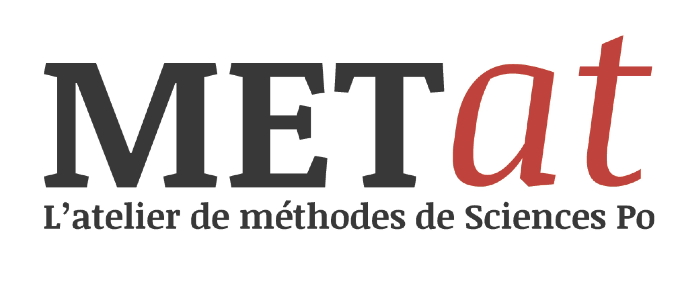

[diegantobass.github.io/mateshs_lyon](diegantobass.github.io/mateshs_lyon)

-

##[La page officielle du METAT](http://www.sciencespo.fr/recherche/fr/content/metat-latelier-de-methodes)

_Le METAT est un atelier “portes ouvertes” d'accompagnement aux méthodes de recherche en SHS_

_Il se déroule chaque deuxième mardi du mois de 14h30 à 17h30 sur le campus parisien de Sciences Po._

_Ouvert à tous les profils, sans restriction de status ou d'affiliation_

===

## Histoire

- Idée proposée en juillet 2011 par Paul Girard et les ingénieurs/développeurs du __médialab de Sciences Po__
- _Users Tuesday, Open Lab, Atelier du médialab, ..._
- Traces du premier atelier début 2013 (septembre)

-

## But

- Temps réservé aux demandes d'aide/soutien/support/accompagnement technique et méthodologique faites aux ingénieurs
- Volonté d'ouverture du laboratoire aux usagers des outils développés
- Moyen de se forcer à documenter les outils, les mettre à jour, s'y former, etc...

-

## Transformations récentes

- Renommé METAT à la création du METSEM en septembre 2016
- Passage d'un atelier quasi-secret sur invitation à un atelier portes-ouvertes sur inscription, ouvert à toute la communauté académique de Sciences Po
- Agrandissement de l'équipe encadrante à tous les personnels de soutien à la recherche

===

###Le METAT aujourd'hui

- Une petite communauté de ~25 encadrants aux compétences diverses et variées : ingénieurs de recherche ou d'études, archivistes, documentalistes et cartographes
- [Un magnifique formulaire d'inscription](https://docs.google.com/forms/d/e/1FAIpQLScrK_0mdUlaz8eWgbGNISrUEBia4I0Y-T4NNtkBWNe1OddmvQ/viewform)
- Une mailing-list pour gérer les inscriptions, les compétences nécessaires, les formations plénières éventuelles à organiser
- Bientôt une communication à l'extérieur de Sciences Po

===

###Déroulement d'une séance - amont

- Diffusion auprès de tout le personnel Sciences Po
- Inscription ou invitation par formulaire
- Fermeture des inscriptions si forte affluence
- Tri des inscrits et mail de rappel d'inscription

-

### Déroulement d'une séance - jour j

- Accueil des participants (la salle change à chaque séance)
- Tour de table des participants, de leur problèmes et besoins
- Partage en groupes de travail selon affinités, envies et possibilités de factorisation des demandes
- _3 heures de travail intense et productif_
- Compte-rendus co-écrits par encadrés et encadrants

-

### Déroulement d'une séance - aval

- Debriefing
- Formations en plénière nécessaire
- Veille outils

===

###Merci

[@diegantobass](twitter.com/diegantobass)

[diego.antolinosbasso@gmail.com](mailto:diego.antolinosbasso@sciencespo.com)

<a href="https://sciencespo.fr/cevipof">

</a>
<a href="https://medialab.sciencespo.fr/">

</a>

